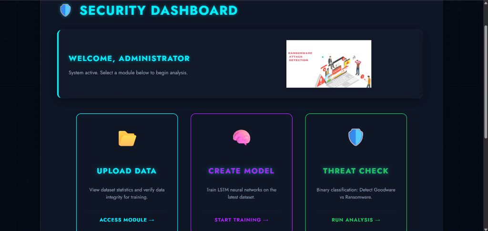
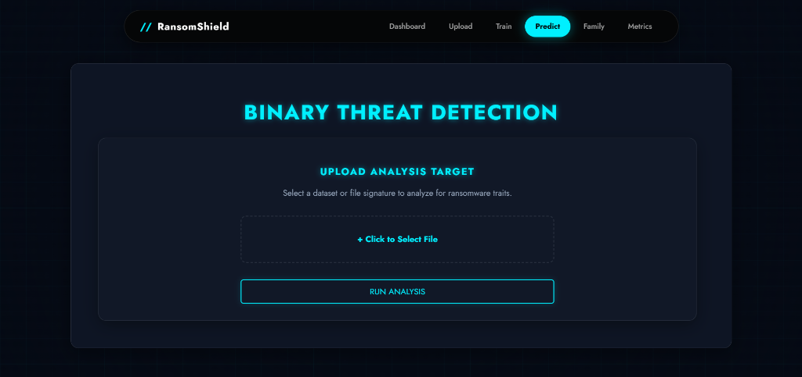

# 🛡️ RansomShield

> **Next-Generation Ransomware Detection & Analysis System**
> *Powered by Deep Learning (LSTM) and Behavioral Analysis*


## 📖 Overview

**RansomShield** is an advanced security dashboard designed to detect, analyze, and classify ransomware threats using Machine Learning. By leveraging Long Short-Term Memory (LSTM) neural networks, it analyzes file system behavior to distinguish between benign software (Goodware) and malicious ransomware, and can further classify the specific family of ransomware (e.g., WannaCry, Ryuk).

## ✨ Key Features

*   **🔐 Secure Authentication**: Robust user login system with secure session management.
*   **📊 Interactive Dashboard**: Centralized hub for accessing all security modules.
*   **📂 Data Management**: Upload and validate datasets for model training.
*   **🧠 Model Training**: Train custom LSTM models directly from the web interface.
*   **🛡️ Threat Prediction**: Binary classification module to detect **Goodware vs. Ransomware**.
*   **🧬 Family Classification**: Multi-class classification to identify specific **Ransomware Families**.
*   **📈 Advanced Analytics**: Visual metrics including Accuracy, Loss curves, and Confusion Matrices.
*   **💎 Professional UI**: Modern, glassmorphism-inspired "Cyber" aesthetic with a responsive design.

## 🛠️ Tech Stack

*   **Backend**: Django (Python web framework)
*   **Frontend**: HTML5, CSS3 (Custom Glassmorphism Theme), JavaScript
*   **ML Engine**: TensorFlow / Keras (LSTM Networks)
*   **Data Processing**: Pandas, NumPy, Scikit-learn
*   **Database**: SQLite (Default)
*   **Visualization**: Matplotlib / Seaborn

## 🚀 Installation & Setup

### Prerequisites
*   Python 3.8 - 3.11 (Recommended for TensorFlow compatibility)

### Steps

1.  **Clone the Repository**
    ```bash
    git clone https://github.com/yourusername/ransomshield.git
    cd ransomshield
    ```

2.  **Create a Virtual Environment**
    ```bash
    python -m venv venv
    # Windows
    venv\Scripts\activate
    # Mac/Linux
    source venv/bin/activate
    ```

3.  **Install Dependencies**
    ```bash
    pip install -r requirements.txt
    ```

4.  **Apply Database Migrations**
    ```bash
    python manage.py migrate
    ```

5.  **Run the Server**
    ```bash
    python manage.py runserver
    ```

    Access the application at: `http://127.0.0.1:8000/`

## 📸 Screenshots

| Login Page | Dashboard |
|:---:|:---:|
|  |  |

| Upload Data | Training Model |
|:---:|:---:|
|  |  |

| Threat Prediction |
|:---:|
|  |

## 🤝 Contributing

Contributions, issues, and feature requests are welcome! Feel free to check the [issues page](issues).

## 📝 License

This project is licensed under the MIT License - see the [LICENSE](LICENSE) file for details.
